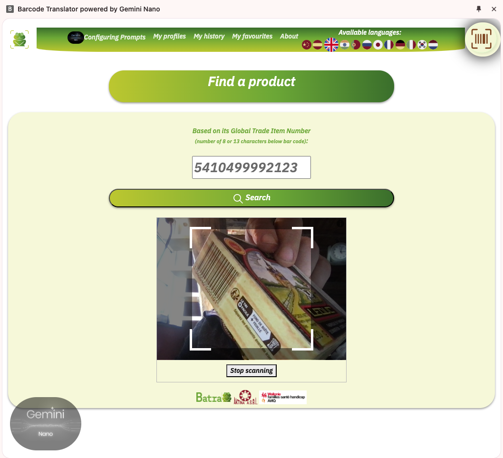
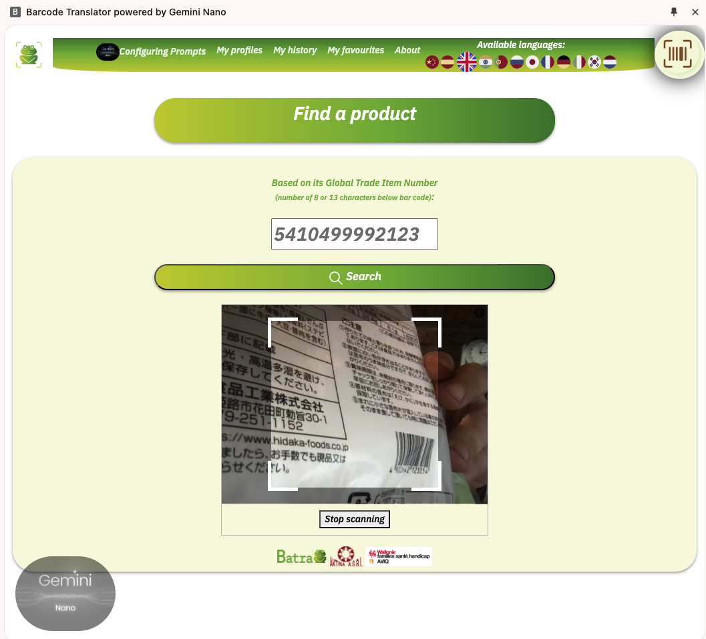
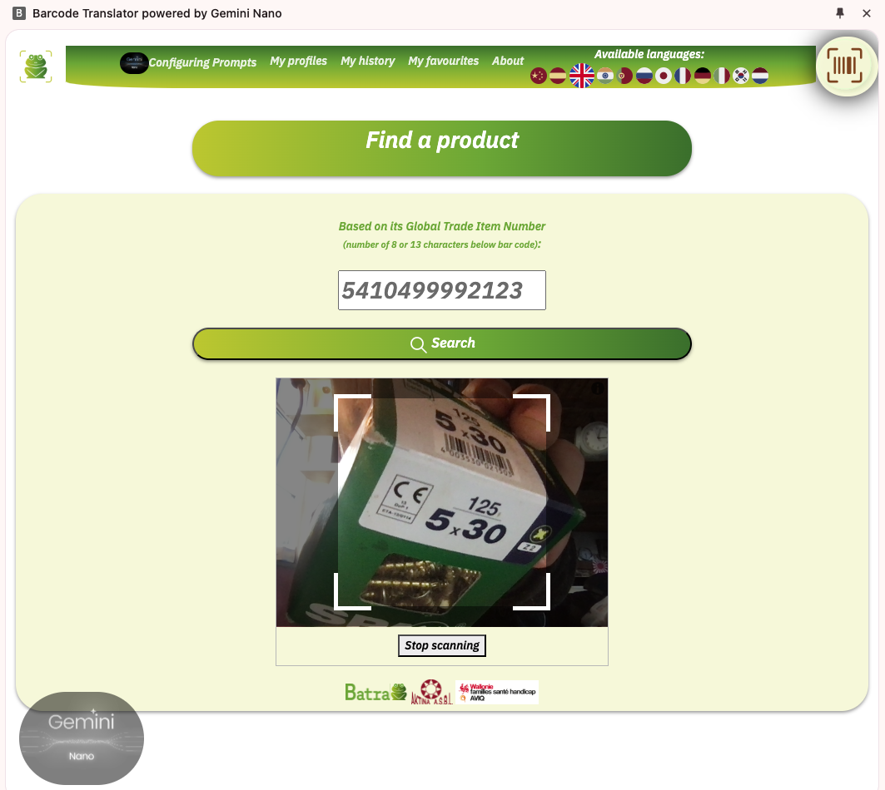
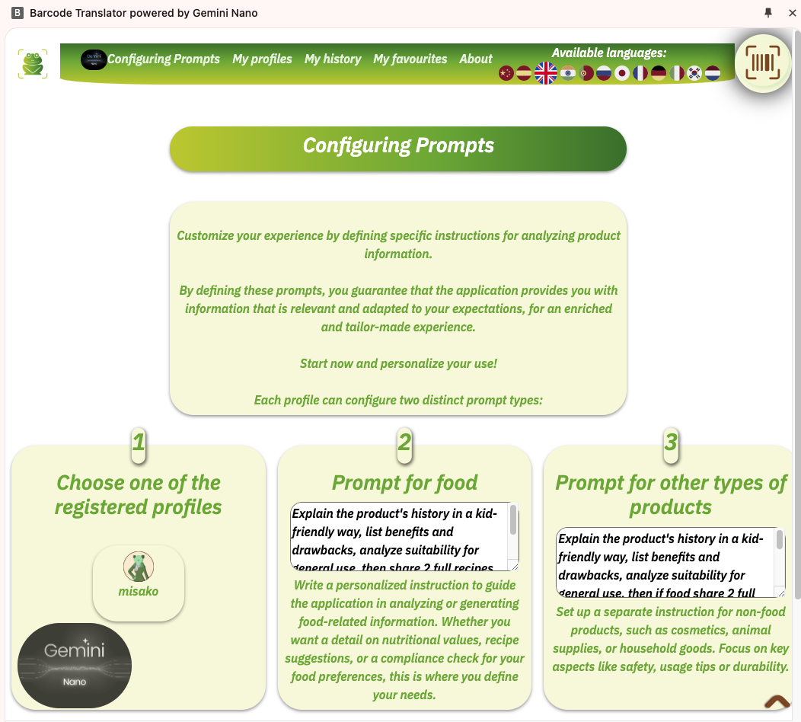
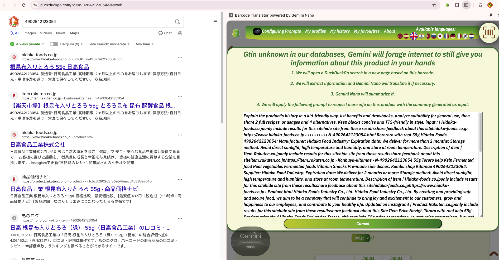
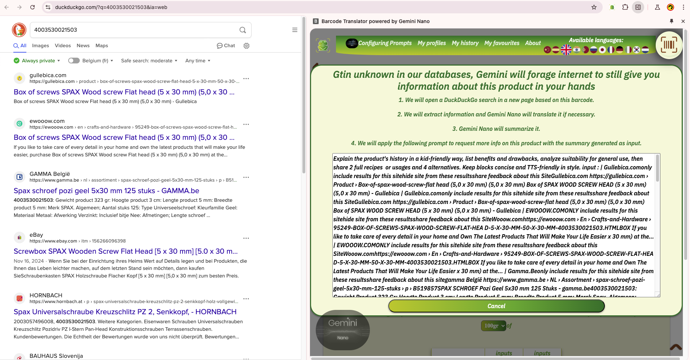

# 📦 Barcode Translator Extension GeminiNano: Tool for BaTra  
**A revolutionary browser extension transforming how we understand product information, one scan at a time.**  

---

## 🌟 Introduction  

Welcome to the **Barcode Translator Extension**, a next-generation tool designed to bridge the gap between product data and consumer understanding. Whether you're scanning a food item or exploring non-food products, this extension seamlessly extracts GTINs (Global Trade Item Numbers) from barcodes and delivers concise, accessible, and multilingual information.  

Imagine having a personalized digital assistant that not only deciphers product details but also shares computationally expensive results through decentralized platforms like Archive.org for reuse. Inspired by the legendary work of Saint Isidore of Seville, this project catalogs product information like an encyclopedia, where **GTINs replace words in the index**.  

---

## 🎯 Key Features  

### 🛠 **What Makes It Unique?**
- **🔍 Barcode Scanning:** Use your webcam or image uploads to detect GTINs with precision.  
- **📝 Custom Prompts:** Tailor responses for food and non-food items to fit your needs.  
- **🗣️ Text-to-Speech:** Accessible, user-friendly audio outputs in multiple languages.  
- **🌐 Multilingual Translation:** Translate product information effortlessly for global audiences.  
- **📂 Decentralized Storage TODO:** Store and reuse data (inputs, prompts, outputs) on Archive.org, reducing energy-intensive computations.  

---

## 📸 Screenshots  

### Home Page  
_A clear, intuitive interface welcoming users._  
  

### Barcode Scanning  
_Simple and efficient barcode detection in action._  
<div style="display: flex; justify-content: center; gap: 10px; flex-wrap: wrap;">
    <div>
        <h3>Barcode Scanning Food</h3>
        
    </div>
    <div>
        <h3>Barcode Scanning Food foreign language</h3>
        
    </div>
    <div>
        <h3>Barcode Scanning Product</h3>
        
    </div>
    
</div>

### Custom Prompt Configuration  
_Fully customizable prompts for tailored results._  
 

### Output Display  
_A concise, readable display of product information._  

<div style="display: flex; justify-content: center; gap: 10px; flex-wrap: wrap;">
    <div>
        <h3>Output Display Food</h3>
        
   </div>
    <div>
        <h3>Output Display Food foreign language</h3>
     
    </div>
   <div>
        <h3>Output Display Product</h3>
        
    </div>
    
</div>


---

## 🚀 How to Install  

1. Clone the repository:  
   ```bash
   git clone https://github.com/your-username/barcode-translator.git
